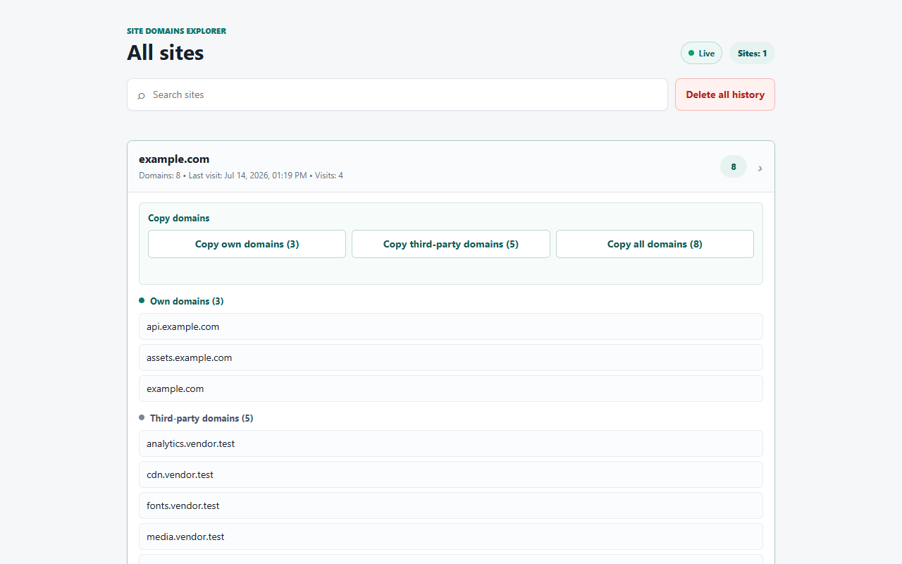

# Site Domains Explorer

Site Domains Explorer is a fully open-source Chromium extension that shows the first-party and third-party hostnames used by the current website. It monitors network activity in near real time, stores only hostname-level history locally, and lets users search, inspect, categorize, copy, and delete the results.



## Features

- Near-real-time hostname discovery with `chrome.webRequest.onBeforeRequest`.
- Resource Timing, DOM, stylesheet, mutation, SPA, and hash-navigation scanning.
- Packaged observers for fetch, XMLHttpRequest, Beacon, WebSocket, EventSource, Worker, Service Worker registration, and WebTransport destinations.
- First-party and third-party categorization for the current site and saved history.
- Copy controls for own, third-party, or all domains.
- Searchable, expandable history stored in `chrome.storage.local`.
- Explicit opt-in collection, local-only data, and one-click history deletion.
- English, Spanish, German, Portuguese (Brazil), Russian, Ukrainian, and French interfaces.
- Manifest V3 with no analytics, telemetry, remote code, or external backend.

## Privacy

Collection is disabled until the user accepts the in-product disclosure. The extension extracts and saves hostnames, visit timestamps, and visit counts. It does not persist full URLs, paths, query strings, page content, cookies, credentials, request bodies, response bodies, form values, or clipboard contents.

See [PRIVACY_POLICY.md](PRIVACY_POLICY.md) and [OPEN_SOURCE_POLICY.md](OPEN_SOURCE_POLICY.md) for the complete disclosures.

## Install From Source

1. Clone this repository.
2. Open `chrome://extensions` in Chrome or another Chromium browser.
3. Enable **Developer mode**.
4. Select **Load unpacked** and choose the repository root.
5. Review the privacy disclosure and explicitly enable collection.

## Build

Run the production validation and packaging script from PowerShell:

```powershell
./build.ps1
```

The release ZIP is created in `dist/`. Version `1.0.0` is intentionally locked in the build script and must not be changed without explicit repository-owner approval.

## Permissions

- `storage`: keeps consent, language, and hostname history locally.
- `webRequest`: observes request destinations without blocking or modifying traffic.
- `webNavigation`: associates regular, SPA, and fragment navigation with the correct site.
- `http://*/*` and `https://*/*`: enables the extension's core hostname-discovery function on sites selected by the user.

## Русский

Site Domains Explorer полностью открыт под лицензией MIT. Расширение определяет собственные и сторонние hostname посещаемых сайтов почти в реальном времени, сохраняет данные только локально и начинает сбор исключительно после явного согласия пользователя.

Для установки из исходников откройте `chrome://extensions`, включите режим разработчика, нажмите **Загрузить распакованное расширение** и выберите корень репозитория.

## Contributing

See [CONTRIBUTING.md](CONTRIBUTING.md). Security, privacy, permission, and data-processing changes must remain transparent and documented.

## License

Released under the [MIT License](LICENSE).
